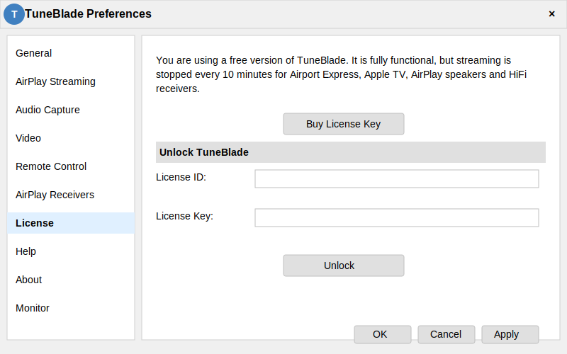

# TuneBlade Key Generator

<div align="center">
  
  <p><em>Генератор ключей для активации программы TuneBlade</em></p>
</div>


## 🌐 Доступ к генератору

Генератор ключей доступен по адресу: [https://crosser23.github.io/tuneblade-key-generator/](https://crosser23.github.io/tuneblade-key-generator/)

## 📋 Описание

TuneBlade Key Generator - это веб-приложение для генерации ключей активации программы TuneBlade. Приложение работает полностью на стороне клиента, не передавая никаких данных на сервер, что обеспечивает приватность и безопасность.

### Особенности:

- ✅ Мгновенная генерация ключей активации
- 🔒 Безопасно: весь код выполняется только на вашем устройстве
- 🌍 Поддержка трех языков: Русский, English, 中文
- 📱 Адаптивный дизайн для мобильных и десктопных устройств
- 📋 Пошаговые инструкции по активации
- 📋 Копирование ключа в буфер обмена одним кликом

## 🚀 Как пользоваться

### Шаг 1: Генерация ключа

1. Откройте [генератор ключей](https://crosser23.github.io/tuneblade-key-generator/)
2. Введите свой email-адрес в поле ввода
3. Нажмите кнопку "Сгенерировать ключ"
4. Скопируйте сгенерированный ключ, нажав кнопку "Копировать"

### Шаг 2: Активация TuneBlade

После генерации ключа следуйте инструкциям, которые появятся под формой:

1. Откройте программу TuneBlade и перейдите в меню "Настройки" (Preferences)
2. Выберите раздел "License" в левой панели
3. В поле "License ID" введите ваш email адрес
4. В поле "License Key" вставьте сгенерированный ключ
5. Нажмите кнопку "Unlock"

## 💻 Технологии

- [Next.js](https://nextjs.org/) - React фреймворк
- [TypeScript](https://www.typescriptlang.org/) - Типизированный JavaScript
- [Tailwind CSS](https://tailwindcss.com/) - Utility-first CSS фреймворк
- [GitHub Pages](https://pages.github.com/) - Хостинг

## 🌍 Мультиязычность

Приложение поддерживает три языка:
- 🇷🇺 Русский (по умолчанию)
- 🇬🇧 English
- 🇨🇳 中文

Для переключения языка используйте кнопки в верхней части страницы.

## 📝 Как это работает

Генератор использует хеш-алгоритм MD5 для создания ключа на основе вашего email-адреса. Ключ генерируется по специальному алгоритму, совместимому с системой проверки лицензий TuneBlade.

Весь процесс происходит полностью в вашем браузере, без отправки данных на сервер.

## 🔧 Для разработчиков

Если вы хотите запустить проект локально:

```bash
# Клонирование репозитория
git clone https://github.com/CroSSer23/tuneblade-key-generator.git

# Переход в директорию проекта
cd tuneblade-key-generator

# Установка зависимостей
npm install

# Запуск в режиме разработки
npm run dev

# Сборка проекта
npm run build
```

## ⚖️ Лицензия

MIT

## 👨‍💻 Автор

Created by CroSSer23

---

<div align="center">
  <p>© 2023 TuneBlade Key Generator | by CroSSer23</p>
</div>
